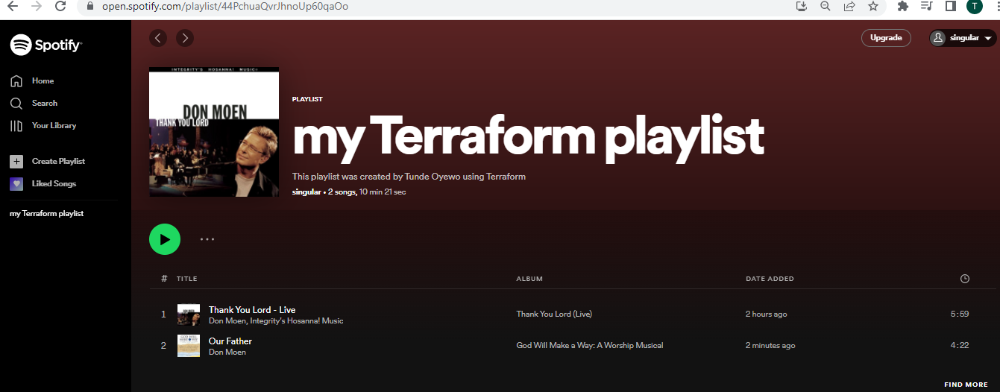

# Create Spotify playlist using Terraform

This tutorial is inspired from the [Create a Spotify Playlist with Terraform](https://learn.hashicorp.com/tutorials/terraform/spotify-playlist) website.

I will be creating a spotify playlist using terraform. Playlist will be created by searching for the artist name and song ID.

In this tutorial the following prerequisites are required:
* Terraform version 1.0 +
* Docker Desktop
* Spotify account with developer access.

We will need to install terraform and docker desktop. I have already installed both terraform and Docker desktop. To check the version of terraform and docker deskto after installation, do the following:

```bash
terraform --version
```

output 

```bash
Terraform v0.14.10
+ provider registry.terraform.io/conradludgate/spotify v0.2.7

Your version of Terraform is out of date! The latest version
is 1.1.9. You can update by downloading from https://www.terraform.io/downloads.html
```

```bash
docker --version
```
output

```bash
Docker version 20.10.7, build f0df350
```
## Create Spotify developer app
Next we will need to created the Spotify developer app. This will allow us to use Terraform with Spotify and to run the Spotify authorization server.

Click on the link to sign up for a free account [here](https://developer.spotify.com/dashboard/login).


## Account creation


Next, on the Dashboard click on the `create an app` button


and add the app name and a description


Next, click on the _edit the green edit setting_ button and copy the url below to the Redirect URIs field and click Add button and save as shown below

```bash
http://localhost:27228/spotify_callback
```


## Run authorization server

Next we will now setup the authorization server that will allow Terraform to interact with spofify.


**image from https://learn.hashicorp.com/**

Next, we set the redirect URI as an environment variable which instruct the authorization proxy server to grant our Spotify access token on port `27228`.

Next we run the following on our terminal. Here I am using git bash.

```bash
export SPOTIFY_CLIENT_REDIRECT_URI=http://localhost:27228/spotify_callback
```

Next we create a `.env` file and update it with the `SPOTIFY_CLIENT_ID` and `SPOTIFY_CLIENT_SECRET`

Edit the `.env` file using the vim editor and add the SPOTIFY_CLIENT_ID and SPOTIFY_CLIENT_SECRET and save the file.

Note: Both the SPOTIFY_CLIENT_ID  and SPOTIFY_CLIENT_SECRET can be found on the Dashboard. Click the show client secrete to reveal the secret number.

```bash
touch .env

vim .env
```

## Starting Docker Server

Next we start the docker server and run the code below . This will download and run the spotify-auth-proxy on port 27228 .

```bash
docker run --rm -it -p 27228:27228 --env-file ./.env ghcr.io/conradludgate/spotify-auth-proxy
```


We will need to copy the APIKey because we will need it assign it as a variable in the terraform.tfvars file.
Next we copy the Auth URL and browse, on authenticating the server will display `Authentication Successful`. The server will be left running.

## Clone example repository

Next we will clone the [example terraform repo](https://github.com/hashicorp/learn-terraform-spotify) . It contains the terraform configuration that searches for songs and creates a playlist.

```bash
git clone https://github.com/hashicorp/learn-terraform-spotify.git
```
```bash
cd learn-terraform-spotify
```

Next we open the terraform file with the vscode editor and we can explore the main.tf and the variables.tf, and outputs.tf files.

Next we rename the `terraform.tfvars.example` to `terraform.tfvars`  The `terraform.tfvars` will have our spotify_api_key. We get this key when we run the docker. Note that this file is added to our `.gitigniore` so that we do not expose our apikey on the internet.
```bash
mv terraform.tfvars.example terraform.tfvars
```

## Install the Spotify provider

Next we install the Spotify provider by running the code below

```bash
terraform init
```

output
```bash
Initializing the backend...

Initializing provider plugins...
- Finding conradludgate/spotify versions matching "~> 0.2.6"...
- Installing conradludgate/spotify v0.2.7...
- Installed conradludgate/spotify v0.2.7 (self-signed, key ID B4E4E68AFAC5D89C)

Partner and community providers are signed by their developers.
If you'd like to know more about provider signing, you can read about it here:
https://www.terraform.io/docs/cli/plugins/signing.html

Terraform has created a lock file .terraform.lock.hcl to record the provider
selections it made above. Include this file in your version control repository
so that Terraform can guarantee to make the same selections by default when
you run "terraform init" in the future.

Terraform has been successfully initialized!

You may now begin working with Terraform. Try running "terraform plan" to see
any changes that are required for your infrastructure. All Terraform commands
should now work.

If you ever set or change modules or backend configuration for Terraform,
rerun this command to reinitialize your working directory. If you forget, other
commands will detect it and remind you to do so if necessary.
```


## Update the main.tf file

## Create a playlist by the Song ID
Next we update the main.tf file so that we can create a Spotify playlist by songs IDs. 

Below script searches two songs by there IDs.

```bash
terraform {
  required_providers {
    spotify = {
      version = "~> 0.2.6"
      source  = "conradludgate/spotify"
    }
  }
}

provider "spotify" {
  api_key = var.spotify_api_key
}


# Optional: Find song by ID
data "spotify_track" "Thank_You_Lord_Live_by_id" {
  spotify_id = "6tzwFtw4AHo2tCexPGMzUN"
}

data "spotify_track" "Our_Father_by_id" {
  spotify_id = "3WUw5mYK80vnw7jZd4JNny"
}

resource "spotify_playlist" "playlist" {
  name        = "my Terraform playlist"
  description = "This playlist was created by Tunde Oyewo using Terraform"
  public      = true

    tracks = [
    data.spotify_track.Thank_You_Lord_Live_by_id.id,
    data.spotify_track.Our_Father_by_id.id,
   
  ]
}

```

## Create the playlist

Next we run terraform plan and terraform apply and type Yes when promted
```bash
terraform plan
terraform apply
```

output for terraform apply

```bash
spotify_playlist.playlist: Refreshing state... [id=44PchuaQvrJhnoUp60qaOo]

An execution plan has been generated and is shown below.
Resource actions are indicated with the following symbols:
  ~ update in-place

Terraform will perform the following actions:

  # spotify_playlist.playlist will be updated in-place
  ~ resource "spotify_playlist" "playlist" {
        id          = "44PchuaQvrJhnoUp60qaOo"
        name        = "my Terraform playlist"
      ~ tracks      = [
            "6tzwFtw4AHo2tCexPGMzUN",
          + "3WUw5mYK80vnw7jZd4JNny",
        ]
        # (3 unchanged attributes hidden)
    }

Plan: 0 to add, 1 to change, 0 to destroy.

Do you want to perform these actions?
  Terraform will perform the actions described above.
  Only 'yes' will be accepted to approve.

  Enter a value: yes

spotify_playlist.playlist: Modifying... [id=44PchuaQvrJhnoUp60qaOo]
spotify_playlist.playlist: Modifications complete after 1s [id=44PchuaQvrJhnoUp60qaOo]

Apply complete! Resources: 0 added, 1 changed, 0 destroyed.

Outputs:

playlist_url = "https://open.spotify.com/playlist/44PchuaQvrJhnoUp60qaOo"
```
Next we click on the playlist_url and open the spotify playlist.

Below shows the



## Create a playlist by Song Artist name
Next, we create a Spotify playlist by using the Artist name.
Below script searches two songs by there Artist.

```bash
terraform {
  required_providers {
    spotify = {
      version = "~> 0.2.6"
      source  = "conradludgate/spotify"
    }
  }
}

provider "spotify" {
  api_key = var.spotify_api_key
}


data "spotify_search_track" "by_artist" {
  artist = "Tori Kelly"
  
}

resource "spotify_playlist" "playlist" {
  name        = "Tori Kelly playlist"
  description = "This playlist was created by Tunde Oyewo using Terraform"
  public      = true

  tracks = [
    data.spotify_search_track.by_artist.tracks[0].id,
    data.spotify_search_track.by_artist.tracks[1].id,
    data.spotify_search_track.by_artist.tracks[2].id,
    data.spotify_search_track.by_artist.tracks[3].id,
    data.spotify_search_track.by_artist.tracks[4].id,
  ]


 
}


```
Next we run below: 

```bash
terraform apply -auto-approve
```
output

```bash
spotify_playlist.playlist: Refreshing state... [id=44PchuaQvrJhnoUp60qaOo]
spotify_playlist.playlist: Modifying... [id=44PchuaQvrJhnoUp60qaOo]
spotify_playlist.playlist: Modifications complete after 0s [id=44PchuaQvrJhnoUp60qaOo]

Apply complete! Resources: 0 added, 1 changed, 0 destroyed.

Outputs:

playlist_url = "https://open.spotify.com/playlist/44PchuaQvrJhnoUp60qaOo"
```


Great!, we have been able to create a Spotify playlist using Terraform!.


